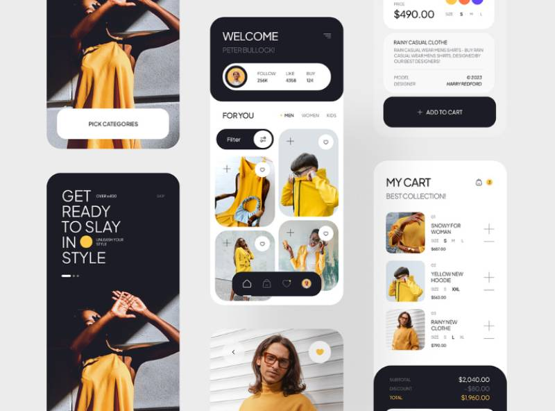
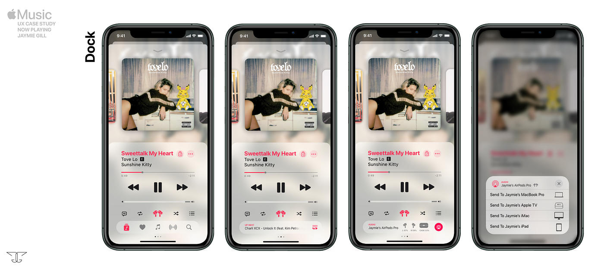
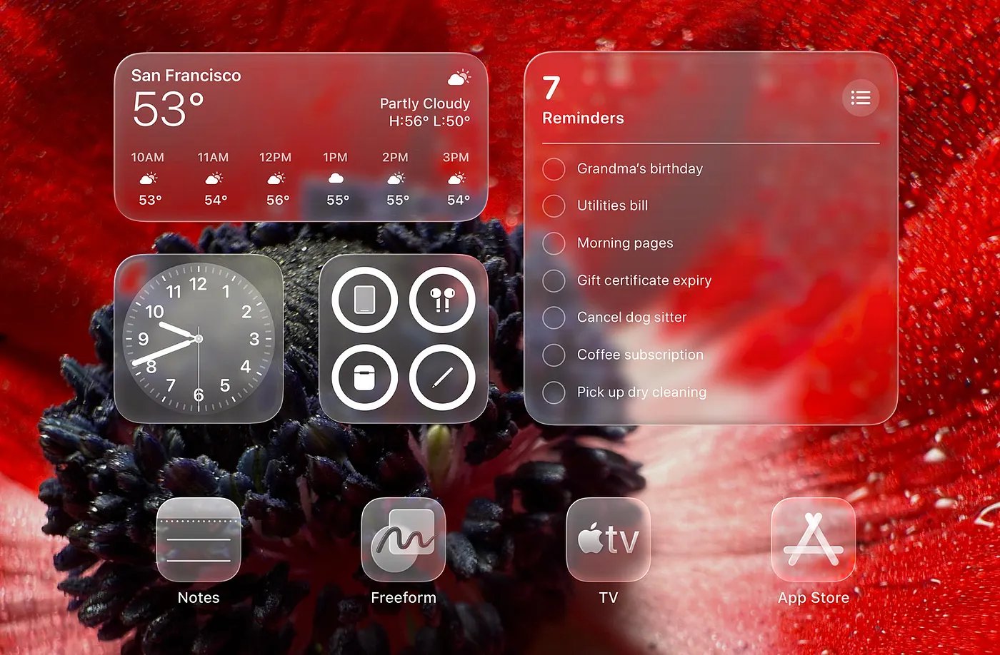

# Atelier UI

A collection of UI design skills for premium digital products.

## Available Skills

| Skill | Description |
|-------|-------------|
| `editorial-designer` | Editorial/fashion magazine aesthetic for lifestyle apps |
| `apple-ui-designer` | iOS Human Interface Guidelines, native Apple feel |
| `ios-glass-ui-designer` | iOS-native glass materials (translucency, blur, depth) with restraint |

## Installation

**Via Marketplace:**
```bash
claude /plugin marketplace add heyman333/atelier-ui
claude /plugin install heyman333@atelier-ui
```

To update:
```bash
claude /plugin marketplace update atelier-ui
```

**Codex (project-scoped):**
1) Add `skills/<skill-name>/` to your repo
2) Register it in `README.md` or `AGENTS.md`:
   - editorial-designer: ... (file: skills/editorial-designer/SKILL.md)
   - apple-ui-designer: ... (file: skills/apple-ui-designer/SKILL.md)
3) Use: `$editorial-designer <request>` or `$apple-ui-designer <request>`

**Codex (global):**
1) Copy the folder to `$CODEX_HOME/skills/<skill-name>` (usually `~/.codex/skills/`)
2) Use: `$editorial-designer <request>` or `$apple-ui-designer <request>`

## Overview

Atelier UI provides multiple design skills for different aesthetics:

### editorial-designer
Brings the refined aesthetic of fashion editorials and magazine layouts to digital product design. Interfaces feel curated, confident, and intentional.

### apple-ui-designer
Applies iOS Human Interface Guidelines and modern Apple design language. Interfaces feel native, calm, and inevitable — like first-party Apple apps.

### ios-glass-ui-designer
Applies iOS material system with tasteful glass effects (translucency, blur, depth). Glass is used as a tool for hierarchy and focus — not as decoration. Perfect for modern iOS interfaces that need layered depth without overdoing glassmorphism.

## Design Examples

### Editorial Designer



This example showcases a fashion e-commerce app designed with editorial principles:

- **Bold Typography** — "GET READY TO SLAY IN STYLE" demonstrates confident, editorial-style headlines
- **Dark & Light Contrast** — Strategic use of dark cards against light backgrounds creates visual depth
- **Accent Color Strategy** — Yellow serves as a cohesive accent throughout, from clothing imagery to UI elements
- **Minimal UI Chrome** — Clean buttons, subtle icons, and text-based navigation reduce visual noise
- **Card-Based Layout** — Rounded corners and generous padding create a premium, tactile feel
- **Whitespace as Design** — Intentional breathing room guides the eye and elevates content

### Apple UI Designer



This Apple Music "Now Playing" UX case study demonstrates Apple-native design principles:

- **Translucency & Depth** — Frosted glass dock and sheets create layered visual hierarchy
- **Progressive Disclosure** — Information reveals contextually through swipe-up dock interaction
- **System-like Components** — Native bottom sheets, standard iOS control layouts
- **Touch Target Clarity** — Large, comfortable hit areas for playback controls
- **Color Restraint** — Accent color (pink) used sparingly, letting content breathe
- **Gesture-first Design** — Swipe-up dock, drag-to-dismiss sheets feel native to iOS

### iOS Glass UI Designer



This iOS home screen demonstrates the glass material system in action:

- **Material Hierarchy** — Different blur/opacity levels based on content needs (weather vs reminders vs controls)
- **Background Adaptation** — Glass intensity scales with background complexity
- **Legibility First** — Text remains clear despite translucency
- **Restraint** — Glass only where it aids hierarchy, not everywhere
- **Depth Without Borders** — Separation achieved through material, not outlines
- **System Consistency** — All glass surfaces feel unified and native

## Design Principles

- **Typography-first** — Large, expressive headlines with strong visual hierarchy
- **Monochrome foundation** — White, off-white, black, charcoal, beige
- **Editorial tension** — Intentional asymmetry, broken grids, generous whitespace
- **Minimal affordances** — Flat buttons, text-based actions, trust user intuition
- **Subtle motion** — Opacity, translate, scale ≤ 1.05. No bounce or spring.

## When to Use Each Skill

### editorial-designer
- Fashion, lifestyle, and premium brand experiences
- Landing pages with bold typography
- 20s-30s urban audience targeting

### apple-ui-designer
- iOS-native mobile apps
- Apps following Human Interface Guidelines
- Native-feeling system UI components

### ios-glass-ui-designer
- iOS apps with layered UI (sheets, overlays, floating controls)
- Interfaces needing depth and material hierarchy
- Modern iOS aesthetic with restrained glassmorphism

## Usage Examples

### editorial-designer

```
editorial-designer 스킬을 사용해서 App.css를 수정해줘
```

```
Use editorial-designer to redesign my landing page with fashion magazine aesthetics
```

### apple-ui-designer

```
apple-ui-designer 스킬로 설정 화면을 iOS 네이티브 스타일로 바꿔줘
```

```
Use apple-ui-designer to make my app feel like a native iOS application
```

### ios-glass-ui-designer

```
ios-glass-ui-designer 스킬로 바텀시트에 글래스 효과 적용해줘
```

```
Use ios-glass-ui-designer to add tasteful glass materials to my navigation overlay
```

## Contributing

We welcome contributions! Here's how to submit a PR:

### Adding a New Design Example

1. **Fork** this repository
2. **Add your image** to `images/` directory
3. **Update documentation**:
   - Add example section in main `README.md` under "Design Examples"
   - If skill-specific, update the skill's `README.md` (e.g., `skills/apple-ui-designer/README.md`)
4. **Submit PR** with:
   - Clear title describing the addition
   - Screenshot/image in PR description
   - Brief explanation of design principles demonstrated

### Updating Design Guidelines

1. **Fork** this repository
2. **Edit** the relevant `SKILL.md` file:
   - `skills/editorial-designer/SKILL.md`
   - `skills/apple-ui-designer/SKILL.md`
   - `skills/ios-glass-ui-designer/SKILL.md`
3. **Submit PR** with:
   - Rationale for the change
   - Examples demonstrating the updated guideline

### PR Template

```markdown
## Summary
Brief description of changes

## Type
- [ ] New design example
- [ ] Design guideline update
- [ ] Documentation fix
- [ ] New skill

## Checklist
- [ ] Images optimized (< 1MB recommended)
- [ ] Documentation updated
- [ ] Follows existing style conventions
```

### Code of Conduct

- Keep PRs focused and atomic
- Provide visual examples when adding design guidelines
- Respect the existing design philosophy of each skill

## License

MIT
